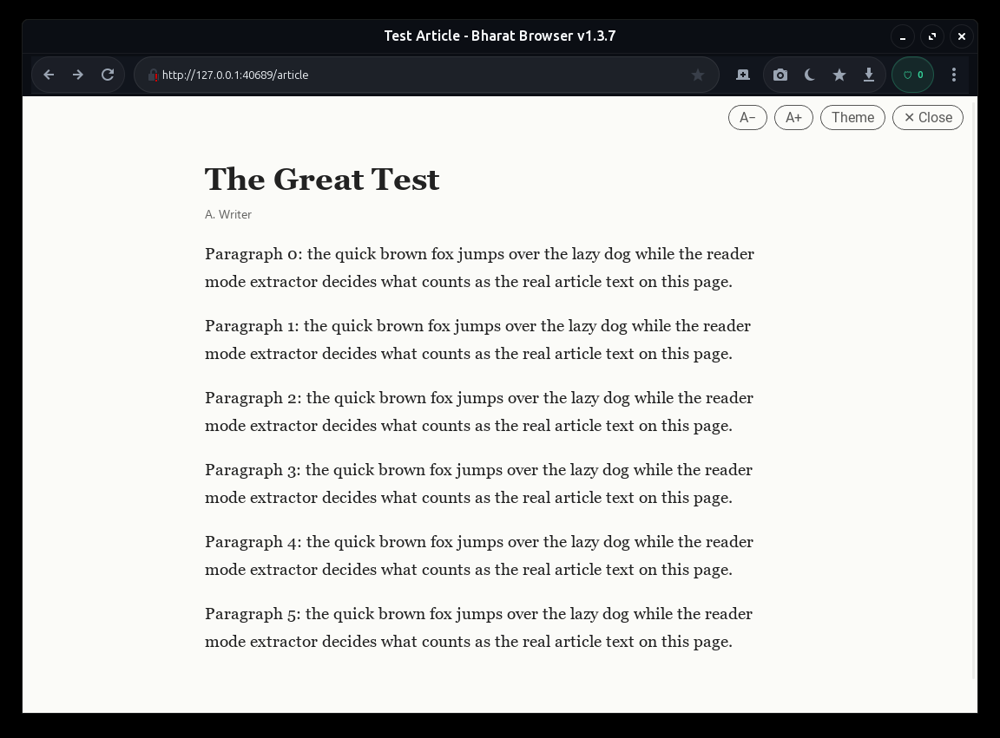
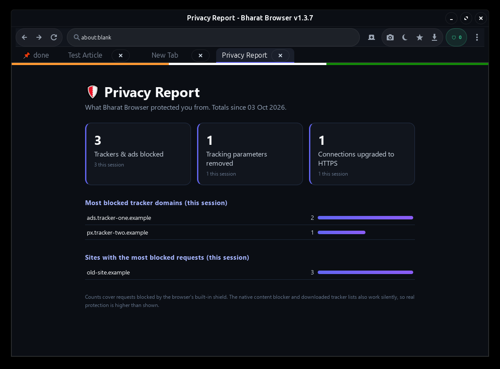
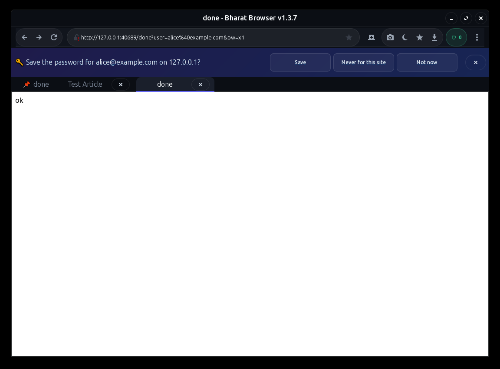
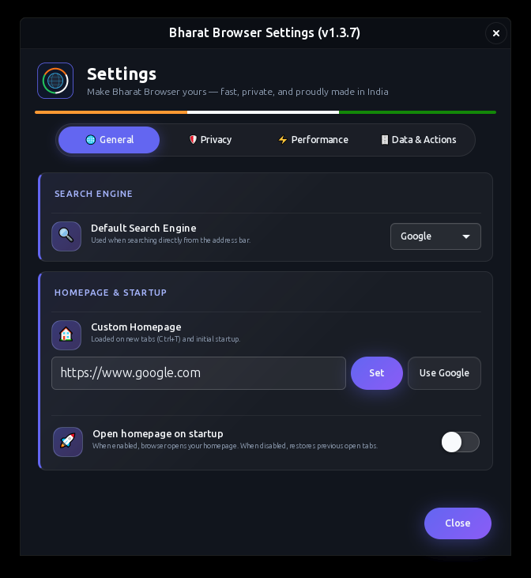
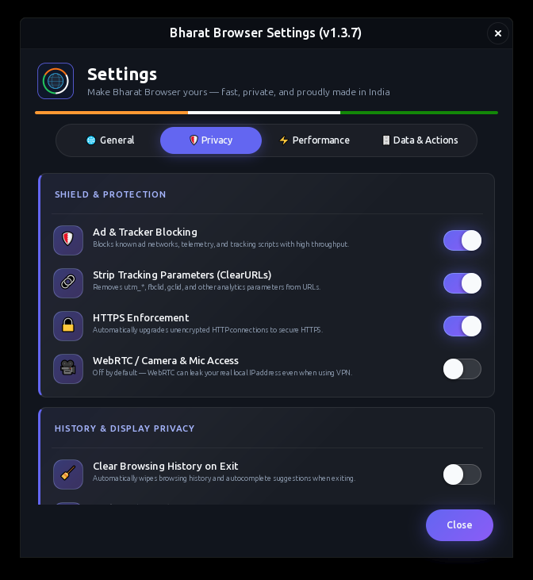
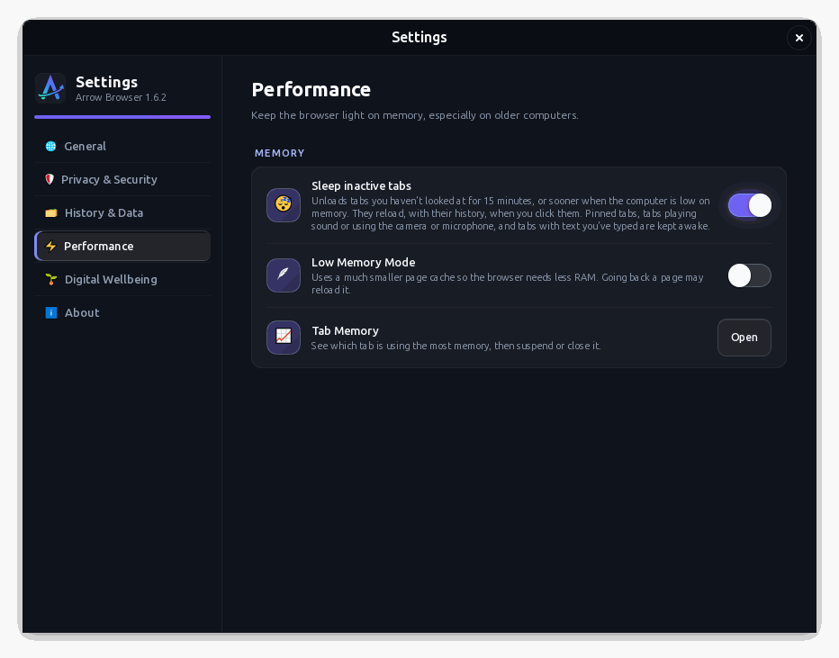
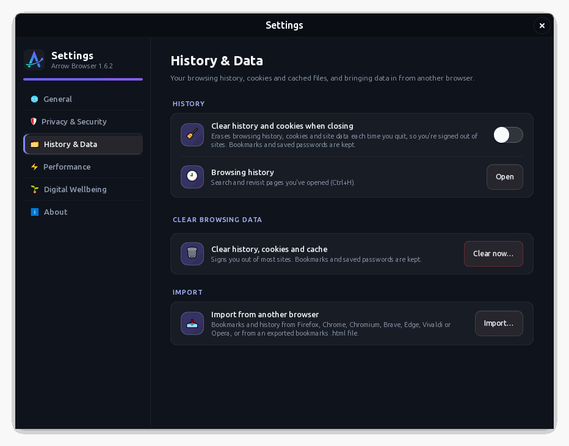

<div align="center">


<h1>Bharat Browser</h1>

<p><b>A tiny, fast, privacy-first web browser for Linux.<br>Built on WebKitGTK. Made in India.</b></p>

[](https://github.com/Sangam1112/bharat-browser/releases/latest)
[](LICENSE)
[](#-install)
[](#-small-by-design)
[-6366f1.svg)](#-keeping-it-up-to-date)

[**Highlights**](#-highlights) · [**Benchmarks**](#-benchmarks-vs-ungoogled-chromium) · [**Screenshots**](#-screenshots) · [**Install**](#-install) · [**Update**](#-keeping-it-up-to-date) · [**Shortcuts**](#-keyboard-shortcuts) · [**Privacy**](#-privacy--what-it-connects-to)

</div>

---

## 🌟 Why Bharat Browser?

<table>
  <tr>
    <td width="25%" valign="top"><h3>🪶 Tiny</h3>A ~104 KB installer. It uses the WebKitGTK already on your system instead of shipping its own 150 MB engine.</td>
    <td width="25%" valign="top"><h3>🛡️ Private</h3>Tracker blocking, HTTPS upgrades and cookie protection work from the very first launch.</td>
    <td width="25%" valign="top"><h3>⚡ Light</h3>Built to stay comfortable on older PCs: it sleeps unused tabs and trims its own memory.</td>
    <td width="25%" valign="top"><h3>🔐 Trustworthy</h3>Signed updates, passwords in your system keyring, and no telemetry at all.</td>
  </tr>
</table>

It is a native GTK3 desktop app, not a repackaged Chromium or Electron. The ad blocker, dark mode and tracker protection are built in-house rather than bundled copies of uBlock Origin, DarkReader or ClearURLs; only their public rule lists are downloaded.

---

## ✨ Highlights

**🛡️ Privacy you don't have to configure**
- **Blocks trackers and ads out of the box**, refreshed weekly from EasyList and EasyPrivacy, with a safety list so sign-in pages and captchas keep working.
- **Cleans links**: removes `utm_*`, `fbclid` and hundreds of site-specific tracking tags (ClearURLs rules) and skips tracking redirects such as `google.com/url?q=`.
- **HTTPS-only warning**: if a site can't be reached securely, *you* decide whether to continue over HTTP. There is no silent downgrade.
- **Per-site controls** from the 🔒 icon: ads, JavaScript, zoom and camera/location/notification permissions, remembered site by site.
- **Passwords stay in your system keyring** (GNOME Keyring, KWallet or KeePassXC), never in the browser's own files, and only fill when you click.
- **Leak and fingerprint protection**: third-party cookies blocked, WebRTC off by default (so it can't expose your IP), your real GPU details hidden from websites, and canvas and audio fingerprints given tiny per-site changes so they can't be used to recognise your computer.
- **Privacy report** to see what was stopped, and **private windows** that write nothing to disk.

**🧭 Everyday touches**
- **Reader mode** (`Ctrl+Alt+R`): any article as a clean page with adjustable text size and themes.
- **Pinned tabs** that survive restarts, plus a one-key way to reopen a closed tab.
- **Tab Memory** (main menu): see which tab is using the most memory, then suspend or close it from the list.
- **Switch in a minute**: import bookmarks and history from Firefox, Chrome, Brave, Edge, Vivaldi, Opera and more.
- **A friendly offline page** that reloads itself when you're back online, with a kite game while you wait 🪁.

**🪶 Light on your computer**
- **Sleeps tabs you aren't using** and has a Low Memory Mode, so older PCs stay responsive.
- **Signed self-updates** (Ed25519): a release that isn't signed by the project key is never installed.

---

## 📊 Benchmarks vs Ungoogled Chromium

Measured head-to-head on Linux under identical workloads (`example.com`, `wikipedia.org/wiki/India`, `duckduckgo.com`):

| Metric | Bharat Browser | Ungoogled Chromium | Advantage |
| :--- | :---: | :---: | :---: |
| **Initial Launch (1 Tab)** | **573 MB** | 796 MB | **~28% less RAM** |
| **Multi-Tab Workload (3 Tabs)** | **942 MB** | 1,235 MB (1.23 GB) | **~24% less RAM** |
| **Processes Spawned (1 Tab)** | **9** | 13 | 30% fewer helper processes |
| **Processes Spawned (3 Tabs)** | **11** | 15 | Lower scheduler contention |
| **Package Installer Size** | **~104 KB** (`.deb`) | ~372 MB (Flatpak) | **~3,500× smaller package** |
| **Installed Disk Footprint** | **~2.3 MB** | ~1.8 GB (with runtime) | **~780× less disk space** |

> **Why the difference?** Bharat Browser leverages the system's native WebKitGTK engine already optimized for Linux, rather than bundling duplicate multi-process Chromium engines and heavy runtime containers. In addition, idle background tabs automatically sleep to keep long sessions responsive on older or resource-constrained hardware.

---

## 📸 Screenshots

<table>
  <tr>
    <td align="center"><b>Reader mode</b> (Ctrl+Alt+R)<br></td>
    <td align="center"><b>Privacy report</b><br></td>
  </tr>
  <tr>
    <td align="center"><b>Password prompt &amp; pinned tab</b><br></td>
    <td align="center"><b>HTTPS-only warning</b><br></td>
  </tr>
</table>

<details>
<summary><b>Settings</b> (6 pages)</summary>
<br>
<table>
  <tr>
    <td align="center"><b>General</b><br></td>
    <td align="center"><b>Privacy &amp; Security</b><br></td>
  </tr>
  <tr>
    <td align="center"><b>Performance</b><br></td>
    <td align="center"><b>History &amp; Data</b><br></td>
  </tr>
</table>
</details>

---

## 📦 Install

**Requirements:** Linux with Python 3, GTK 3, PyGObject and **WebKit2GTK 4.1** (4.0 also works). The installers below fetch these for you. Optional: a keyring service (GNOME Keyring / KWallet / KeePassXC) for saved passwords, and a hunspell dictionary for spell check.

### Quick install

Packages are on the [**Releases page**](https://github.com/Sangam1112/bharat-browser/releases/latest). Replace the version if a newer one is out.

<table>
<tr><th>Ubuntu / Debian / Mint</th><th>Fedora / RHEL family</th></tr>
<tr valign="top"><td>

```bash
VERSION=1.5.15
wget https://github.com/Sangam1112/bharat-browser/releases/download/v$VERSION/bharat-browser_${VERSION}-1_all.deb
sudo apt install ./bharat-browser_${VERSION}-1_all.deb
```

</td><td>

```bash
VERSION=1.5.15
wget https://github.com/Sangam1112/bharat-browser/releases/download/v$VERSION/bharat-browser-${VERSION}-1.noarch.rpm
sudo dnf install ./bharat-browser-${VERSION}-1.noarch.rpm
```

</td></tr>
</table>

Use `apt install ./file.deb` (not `dpkg -i`) so the GTK and WebKit dependencies are resolved automatically. Then start it from your application menu, or run `bharat-browser`.

> **Red Hat family (RHEL, Rocky Linux, AlmaLinux, CentOS Stream):** supported since 1.4.2. Fedora calls the WebKit package `webkit2gtk4.1` and these systems call it `webkit2gtk3`; the RPM and `install-fedora.sh` accept either, and the app itself works with WebKit2GTK 4.1 or 4.0. The install logic is covered by automated tests, but it hasn't been run on a real RHEL-family machine yet. If you try it, please tell us how it went in [issues](https://github.com/Sangam1112/bharat-browser/issues).

### Install from source (no root needed)

This installs for your user only (`~/.local`) and gives you the self-updater:

```bash
git clone https://github.com/Sangam1112/bharat-browser.git
cd bharat-browser
./install-ubuntu.sh        # Ubuntu / Debian / Mint
./install-fedora.sh        # Fedora, RHEL, Rocky, AlmaLinux, CentOS Stream
```

Add `--system` to install for all users instead (it asks for `sudo`). If `bharat-browser` isn't found in a new terminal, add this to `~/.bashrc`:

```bash
export PATH="$HOME/.local/bin:$PATH"
```

<details>
<summary><b>Fedora without git</b>: use the release archive</summary>

```bash
VERSION=1.5.15
wget https://github.com/Sangam1112/bharat-browser/releases/download/v$VERSION/bharat-browser_${VERSION}_fedora.tar.gz
mkdir -p /tmp/bharat_fedora
tar -xzf bharat-browser_${VERSION}_fedora.tar.gz -C /tmp/bharat_fedora
cd /tmp/bharat_fedora && ./install-fedora.sh
```
</details>

<details>
<summary><b>Windows 10/11</b> (via WSL2 + WSLg)</summary>

There is no native Windows build. Bharat Browser runs inside **WSL2** and opens as its own window on the Windows desktop through **WSLg** (Windows 11, or Windows 10 build 19044+).

**1. Prepare Windows**

- **Check your Windows version:** press <kbd>Win</kbd>+<kbd>R</kbd>, type `winver`. You need Windows 11, or Windows 10 version 21H2 (build 19044) or later.
- **Install Windows updates:** Settings → Windows Update → *Check for updates*, install everything, and restart.
- **Check virtualization is on:** Task Manager → Performance → CPU should say *Virtualization: Enabled*. If it says Disabled, turn on Intel VT-x / AMD-V (sometimes called SVM) in your PC's BIOS/UEFI settings.

**2. Update WSL (PowerShell as Administrator)**

Right-click the Start button → *Terminal (Admin)* or *Windows PowerShell (Admin)*, then:

```powershell
wsl --update                   # get the latest WSL from Microsoft (it includes WSLg, which shows Linux windows on your desktop)
wsl --version                  # should list a "WSL version" and a "WSLg version"
wsl --set-default-version 2    # new Linux installs use WSL 2
wsl --shutdown                 # restart WSL so the update takes effect
```

If `wsl --update` or `wsl --version` says WSL isn't installed or doesn't recognize the option, you have the old built-in WSL: run `wsl --install`, restart the PC, then run the commands above again.

**3. Set up Ubuntu (PowerShell)**

```powershell
wsl --install -d Ubuntu     # skip if Ubuntu is already installed; reboot if asked
wsl -l -v                   # Ubuntu should show VERSION 2
```

Open **Ubuntu** from the Start menu once to create your Linux username and password. If `wsl -l -v` shows VERSION 1, run `wsl --set-version Ubuntu 2`.

**4. Update Ubuntu (Ubuntu terminal)**

```bash
sudo apt update && sudo apt full-upgrade -y
```

This brings Ubuntu's graphics and WebKit libraries up to date before the browser is installed. If it upgraded a lot, close Ubuntu, run `wsl --shutdown` in PowerShell, and open Ubuntu again.

**5. Install (Ubuntu terminal)**

```bash
git clone https://github.com/Sangam1112/bharat-browser.git
cd bharat-browser
./install-wsl.sh
```

The script uses `sudo apt` (it will ask for your Linux password) to install Python, GTK3, WebKit2GTK and git, then installs the browser to `~/.local/share/bharat-browser` and a launcher at `~/.local/bin/bharat-browser`.

**6. Run it**

```bash
bharat-browser
```

If the command isn't found, add `export PATH="$HOME/.local/bin:$PATH"` to `~/.bashrc` and open a new terminal. Later, use **Settings → About → Check for updates** to stay current.

**7. Add a desktop shortcut (optional)**

So you can start the browser by double-clicking an icon instead of opening Ubuntu first. In the **Ubuntu terminal**, copy the browser's icon to Windows (Windows shortcuts need an `.ico` file):

```bash
WIN_APPDATA="$(wslpath "$(cmd.exe /c 'echo %LOCALAPPDATA%' 2>/dev/null | tr -d '\r')")"
mkdir -p "$WIN_APPDATA/BharatBrowser"
python3 -c 'import struct,sys; p=open(sys.argv[1],"rb").read(); open(sys.argv[2],"wb").write(struct.pack("<3H4B2H2I",0,1,1,0,0,0,0,1,32,len(p),22)+p)' \
  ~/.local/share/bharat-browser/assets/bharat_icon.png "$WIN_APPDATA/BharatBrowser/bharat-browser.ico"
```

Then in **PowerShell** (a normal one, not Administrator), create the shortcut:

```powershell
$s = (New-Object -ComObject WScript.Shell).CreateShortcut("$([Environment]::GetFolderPath('Desktop'))\Bharat Browser.lnk")
$s.TargetPath = "C:\Program Files\WSL\wslg.exe"
$s.Arguments = "-d Ubuntu --cd ~ -- bash -lc bharat-browser"
$s.IconLocation = "$env:LOCALAPPDATA\BharatBrowser\bharat-browser.ico"
$s.Save()
```

A **Bharat Browser** icon appears on your desktop. `wslg.exe` starts the browser without leaving a terminal window open. To pin it, right-click the icon (on Windows 11, then *Show more options*) → **Pin to taskbar** or **Pin to Start**.

- If your Ubuntu has a different name in `wsl -l -v` (for example `Ubuntu-24.04`), put that name after `-d` instead.
- If Windows says it can't find `wslg.exe`, your WSL is out of date: go back to step 2.
- The first launch after starting Windows can take a few seconds while WSL starts up.

**Troubleshooting**

- *No window appears:* check that WSLg works with `sudo apt install -y x11-apps && xeyes`. If that doesn't open either, run `wsl --update` and `wsl --shutdown` in PowerShell, then reopen Ubuntu.
- *Blank or white window:* try `WEBKIT_DISABLE_DMABUF_RENDERER=1 bharat-browser`, a common workaround for WebKitGTK under WSLg.
- *Saving passwords doesn't work:* the password manager needs a system keyring. Run `sudo apt install -y gnome-keyring`. Everything else works without it.

> The WSL installer's logic is the same as the Ubuntu one, but it hasn't been tested on a real Windows machine yet. If you try it, please tell us how it went in [issues](https://github.com/Sangam1112/bharat-browser/issues).
</details>

---

## 🔄 Keeping it up to date

- **Source or user install:** open **Settings → About → Check for updates**. If a newer release exists it is downloaded, its signature is verified, and you just click **Restart now**. The browser also checks quietly about 30 seconds after launch.
- **`.deb` / `.rpm` installs:** the same button works (updates go to `~/.local/share/bharat-browser`, which the launcher prefers), or install the newer package from the [Releases page](https://github.com/Sangam1112/bharat-browser/releases/latest).
- A release that is **not signed by the project key is never installed**, even if the download itself were tampered with.

## 🗑️ Uninstall

```bash
sudo apt remove bharat-browser          # Debian / Ubuntu package
sudo dnf remove bharat-browser          # Fedora package

# user install / self-updated copy
rm -rf ~/.local/share/bharat-browser ~/.local/bin/bharat-browser \
       ~/.local/share/applications/bharat-browser.desktop \
       ~/.local/share/icons/hicolor/256x256/apps/bharat-browser.png

# your data (history, bookmarks, settings, cookies) and cache
rm -rf ~/.config/bharat-browser ~/.cache/bharat-browser
```

Saved passwords are in your system keyring, not in those folders: remove them first from **Settings → Privacy & Security → Saved passwords**.

---

## 🧭 Keyboard shortcuts

| Action | Shortcut | Action | Shortcut |
|---|---|---|---|
| New tab | `Ctrl+T` | Find in page | `Ctrl+F` |
| Close tab | `Ctrl+W` | Bookmark page | `Ctrl+D` |
| Reopen closed tab | `Ctrl+Shift+T` | Bookmark manager | `Ctrl+Shift+O` |
| Next / previous tab | `Ctrl+Tab` / `Ctrl+Shift+Tab` | History dashboard | `Ctrl+H` |
| New private window | `Ctrl+Shift+N` | Reader mode | `Ctrl+Alt+R` |
| Focus address bar | `Ctrl+L` | Print / save as PDF | `Ctrl+P` |
| Back / forward | `Alt+←` / `Alt+→` | Zoom in / out / reset | `Ctrl++` / `Ctrl+-` / `Ctrl+0` |
| Reload | `F5` or `Ctrl+R` | Developer inspector* | `F12` or `Ctrl+Shift+I` |

\* Turn on **Developer tools** in Settings → Advanced first. Touchpad swipe also goes back/forward.

---

## 🔒 Privacy & what it connects to

Bharat Browser has **no telemetry, analytics or accounts**. Besides the sites you visit, it makes only these connections itself:

| What | To | When | Turn off |
|---|---|---|---|
| Update check | `api.github.com`, `raw.githubusercontent.com` | ~30 s after launch, and when you click *Check for updates* | n/a (it only reads a small version file) |
| Ad and tracker lists | `easylist.to` | About once a week | Settings → Privacy & Security → *Keep the block lists up to date* |
| Link-cleaning rules | `rules2.clearurls.xyz` (or `gitlab.com` if that's down) | About once a week | Same switch |
| Link / DNS prefetch | the pages you hover over | While browsing | n/a |

**Where your data lives:** settings, history, bookmarks, session, per-site settings, cookies and statistics are in `~/.config/bharat-browser` (readable only by you); cache in `~/.cache/bharat-browser`; passwords only in your system keyring. Private windows write none of it to disk.

Spotted a security problem? Please open a [GitHub issue](https://github.com/Sangam1112/bharat-browser/issues), or contact the maintainer privately if it's sensitive.

---

## 🪶 Small by design

| Browser | Installer size | Installed size (approx.) |
|---|---|---|
| **Bharat Browser** | **~104 KB** (RPM) / **~90 KB** (.deb) | **~310 KB** |
| Google Chrome | ~90–100 MB | ~250–350 MB |
| Mozilla Firefox | ~55–75 MB | ~200–300 MB |
| Chromium | ~100–150 MB | ~300–400 MB |
| Brave | ~90–110 MB | ~300+ MB |
| Microsoft Edge (Linux) | ~90–100 MB | ~250–350 MB |

That's roughly **500–1000× smaller**. Chrome, Firefox, Chromium, Brave and Edge each bundle a complete rendering engine (Blink + V8, or Gecko + SpiderMonkey), typically 150–250 MB on its own. Bharat Browser ships none of that: it's a ~295 KB Python/GTK3 program that calls into **WebKitGTK**, a system library most Linux desktops already have for other GTK apps, from the same engine family as Safari.

> Bharat Browser's sizes were measured from the v1.5.1 release packages. The other browsers' figures are well-known public approximations that vary by version and platform.

---

## 🙏 Credits

Built on [WebKitGTK](https://webkitgtk.org/) and [PyGObject](https://pygobject.gnome.org/). The optional weekly block lists are [EasyList and EasyPrivacy](https://easylist.to/) by the EasyList authors, and the link-cleaning rules are [ClearURLs](https://gitlab.com/ClearURLs/rules) by Kevin Röbert and contributors. Both are downloaded at runtime, not shipped in the package.

## 📄 License

[MIT](LICENSE) © 2026 Sangam1112
